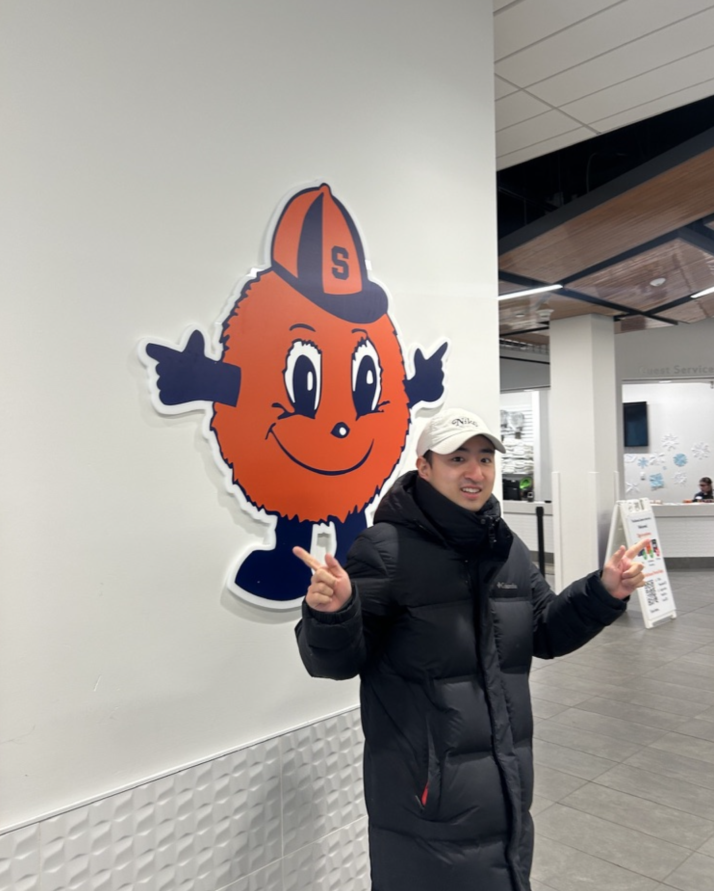

  <!-- Photo + Icons column -->
  

    

    <!-- Icons -->
    

      <!-- Email -->
      <a href="mailto:hcho25@syr.edu" title="Email" target="_blank" style="color: inherit; text-decoration: none;">
        <i class="fas fa-envelope" style="font-size: 24px;"></i>
      </a>

      <!-- LinkedIn -->
      <a href="https://www.linkedin.com/in/hjchrischo" title="LinkedIn" target="_blank" style="color: inherit; text-decoration: none;">
        <i class="fab fa-linkedin" style="font-size: 24px;"></i>
      </a>

      <!-- ORCID -->
      <a href="https://orcid.org/0009-0002-6840-9964" title="ORCID" target="_blank" style="color: inherit; text-decoration: none;">
        <i class="fab fa-orcid" style="font-size: 24px;"></i>
      </a>

      <!-- PhilPeople -->
      
    

  

  <!-- Text column -->
  

    <h1 style="font-size: 2.5em; margin-top: 0;">Chris Cho</h1>

    
I'm a PhD candidate in philosophy at Syracuse University. I work on free will and moral responsibility.

    
I hold a B.A. in Philosophy and Cognitive Science from the University of Toronto.

    
Outside of philosophy, I enjoy CrossFit, running, and visiting record stores.

  

